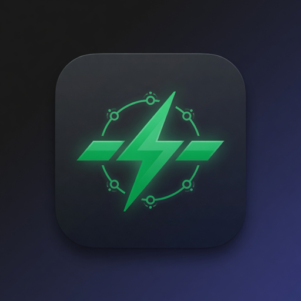
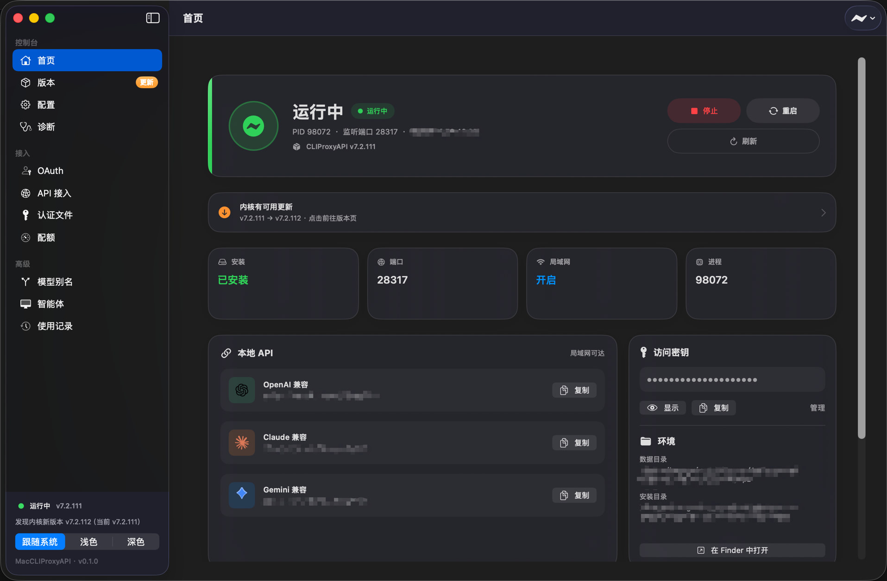
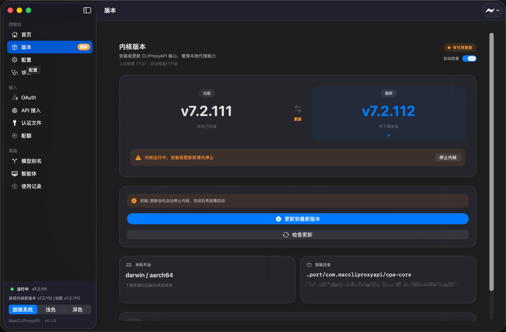
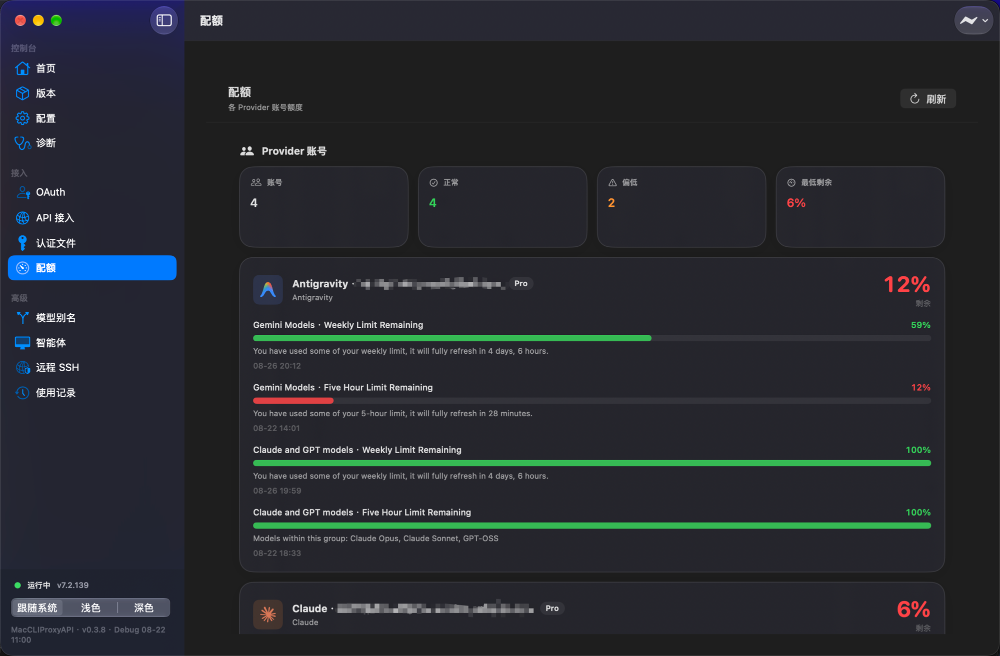
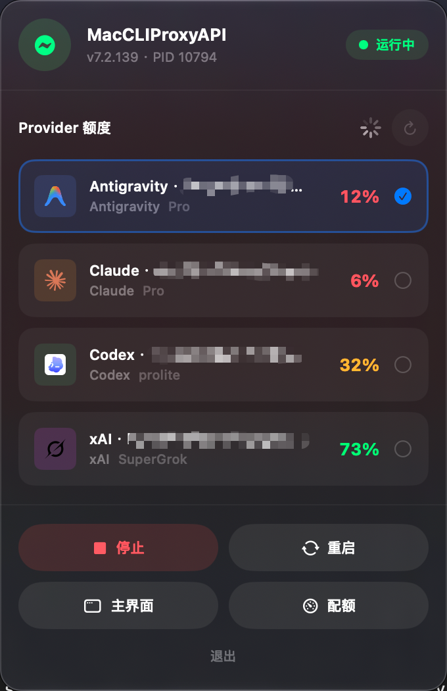
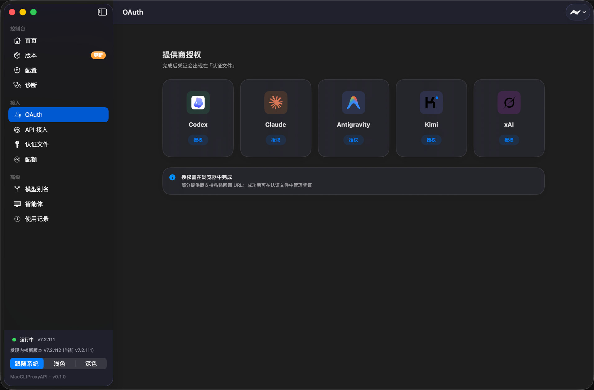
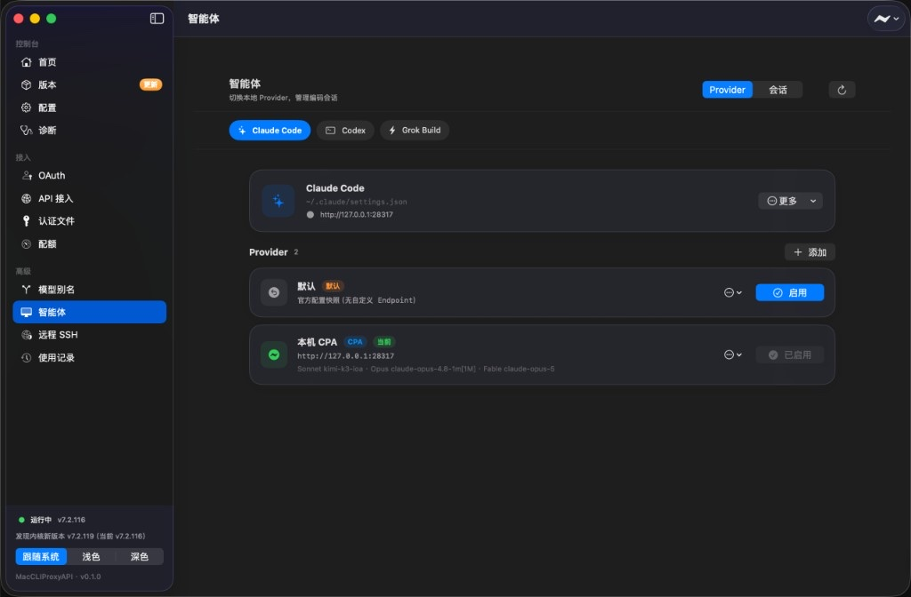
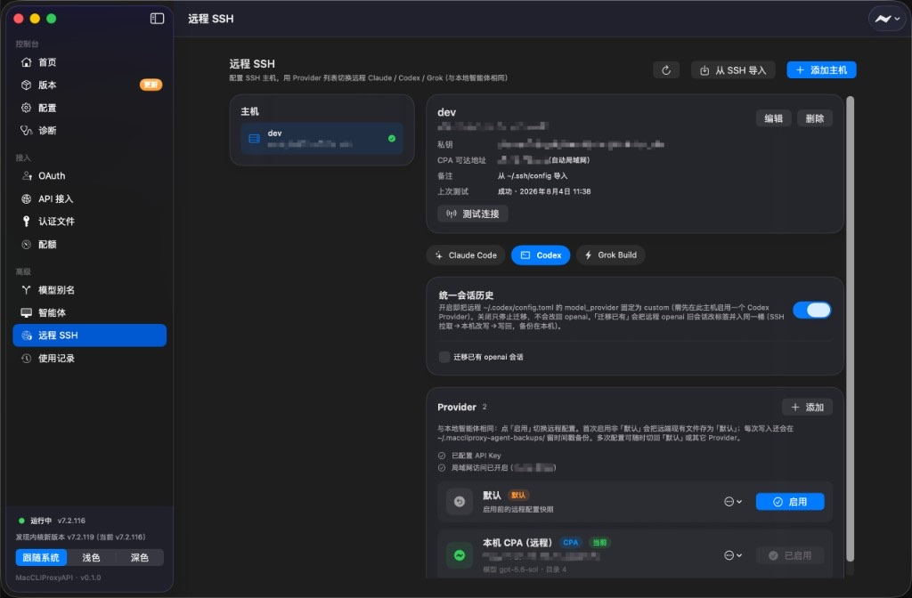
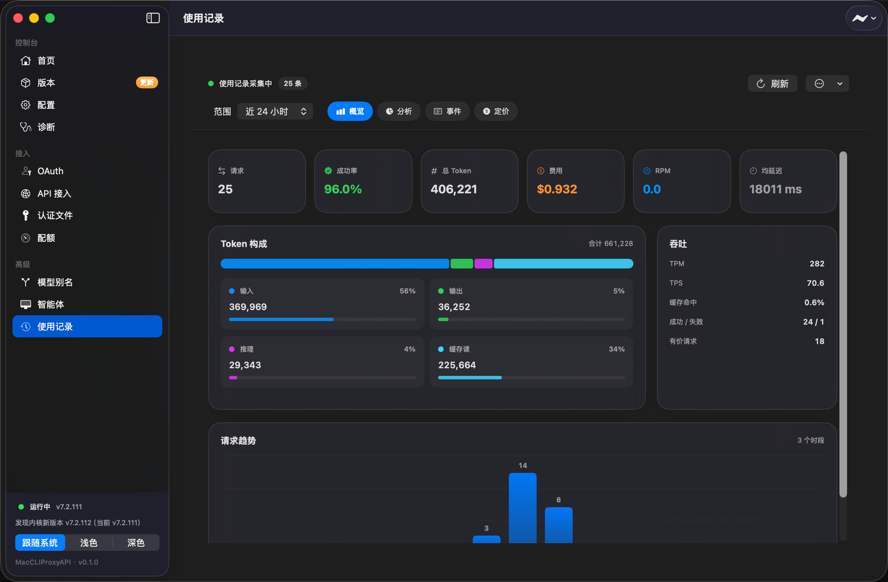

# MacCLIProxyAPI

<p align="center">
  
</p>

<p align="center">
  <strong>CLIProxyAPI 的 macOS 原生桌面控制台</strong><br/>
  安装与管理本地内核 · OAuth / Provider · 账号配额 · 使用记录 · 智能体一键配置
</p>

<p align="center">
  <a href="https://github.com/xiangsam/MacCLIProxyAPI/releases/latest"></a>
  
  
  <a href="LICENSE"></a>
</p>

---

## 目录

- [产品预览](#产品预览)
- [为什么做这个项目](#为什么做这个项目)
- [主要功能](#主要功能)
- [安装（预构建包 · 无需源码）](#安装预构建包--无需源码)
- [从源码构建](#从源码构建)
- [远程压缩与同名模型隔离](#远程压缩与同名模型隔离)
- [安全与数据](#安全与数据)
- [项目结构](#项目结构)
- [使用边界](#使用边界)
- [致谢](#致谢)
- [上游与许可证](#上游与许可证)

---

## 产品预览

### 首页 · 内核状态与本地 API

一屏查看运行状态、局域网地址、OpenAI / Claude / Gemini 兼容端点与访问密钥。

<p align="center">
  
</p>

### 版本 · 内核安装与更新

在线安装最新内核、指定版本安装、本地包安装；内核运行时会提示先停止再安装。

<p align="center">
  
</p>

### 配额 · Provider 账号额度

展示各 OAuth 账号配额。

<p align="center">
  
</p>

### 菜单栏小窗 · 常驻状态与快捷操作

关闭主窗口后仍以菜单栏形态运行：内核启停、Provider 额度一览，一键回到主界面。

<p align="center">
  
</p>

### OAuth · 浏览器授权 Provider

Codex、Claude、Antigravity、Kimi、xAI 等授权流程图形化引导。

<p align="center">
  
</p>

### 智能体 · 本机 Claude Code / Codex 一键切换

统一管理 Claude Code、Codex 的 live 配置（`~/.claude/settings.json`、
`~/.codex/config.toml`）：按 Provider 保存多套接入方式，点击「启用」即写入配置文件，
并标示当前生效的一套。首次启用会先备份原有配置，可随时切回「默认」。启用 Codex「本机 CPA」
时若缺少 `~/.codex/auth.json` 会写入占位，切走时只删除这份占位、不动 ChatGPT 登录文件；
Desktop 不显示自定义模型时，可在 CPA 卡片上清理缓存并重建该文件。Codex 另可开启统一会话历史，
将 `model_provider` 固定为 `custom`，避免切换 Provider 后历史会话分散到不同 bucket；
以及远程压缩与同名模型隔离（见
[远程压缩与同名模型隔离](#远程压缩与同名模型隔离)）。
（Grok Build 客户端管理已移除；xAI / Grok 订阅仍可通过 OAuth 接入，经 Claude Code / Codex 使用。）

<p align="center">
  
</p>

### 远程 SSH · 用同一套 Provider 配置远端主机

当 Agent 的配置文件位于远端开发机时，可从 `~/.ssh/config` 导入主机，使用与本机智能体相同的
Provider 列表切换远端的 Claude / Codex。应用前会先快照远端默认配置以便回滚，写入前在
远端保留一份带时间戳的备份；Codex 的统一会话历史与会话迁移同样支持在远端执行。

<p align="center">
  
</p>

### 使用记录 · 本地 SQLite 采集

从内核 usage 队列采集到本地数据库，支持概览、分析、事件与导出。用量按**凭据**归属，
同一个 API Provider 的多条路由（如聊天与原生 GPT）会合并计入同一个 Provider，而非计入 Codex 订阅。

<p align="center">
  
</p>

---

## 为什么做这个项目

[CLIProxyAPI](https://github.com/router-for-me/CLIProxyAPI) 提供统一的本地 AI API 代理能力，但日常还需要处理：

- 内核下载 / 升级 / 启停  
- 配置文件与 API Key  
- OAuth 凭证与配额  
- 客户端（Claude Code、Codex 等）接入  

MacCLIProxyAPI 把这些收敛到一个 **SwiftUI 原生应用** 中：

- 非 WebView、非跨平台套壳  
- 通过 Management API 管理运行时  
- 使用记录保存在本地 SQLite  
- 关闭主窗口后可继续以 **菜单栏** 形态运行  
- 不附带云端服务，数据默认只在本机  

---

## 主要功能

| 模块 | 功能 |
| --- | --- |
| 首页 | 内核状态、启停/重启；复制 OpenAI / Claude / Gemini 接入地址与 API Key |
| 版本 | 检查更新；在线安装最新版 / 指定版本 / 本地包安装；安装前二次确认与架构、归档校验 |
| 配置 | 端口、局域网、API Keys、路由、上游代理、Session Affinity；展示内核已加载插件 |
| OAuth | Codex、Claude、Antigravity、Kimi、xAI 浏览器授权 |
| API 接入 | 管理 Codex / OpenAI 兼容 / Claude / Gemini；连接测试 |
| 认证文件 | 查看、搜索、启停、上传、删除 OAuth/认证 JSON |
| **配额** | **Provider 账号额度** |
| 模型别名 | Thinking / Reasoning 别名与 effort |
| 智能体 | Claude / Codex：多 Provider 切换写入 live 配置；会话浏览 / 恢复 / 删除；Codex 统一会话历史 |
| **远程 SSH** | **从 `~/.ssh/config` 导入主机，用同一套 Provider 切换远端 Agent 配置；应用前快照、写入前备份** |
| 使用记录 | usage-queue → SQLite；概览 / 分析 / 事件 / 价格估算 / CSV 导出 |
| 诊断 | 内核、Management API、权限、弱密钥、Usage 库状态 |
| **菜单栏** | 内核快捷启停；所选账号剩余额度 |

---

## 安装（预构建包 · 无需源码）

从 [**Releases**](https://github.com/xiangsam/MacCLIProxyAPI/releases/latest) 下载其一：

```text
MacCLIProxyAPI-1.1-macos-universal.dmg      # 推荐：打开后拖进「应用程序」
MacCLIProxyAPI-1.1-macos-universal.zip      # 或者：解压后拖进「应用程序」
```

```bash
# 可选：校验（把文件名换成你下载的那个）
shasum -a 256 -c MacCLIProxyAPI-1.1-macos-universal.dmg.sha256

# 首次打开若提示无法验证开发者：
xattr -dr com.apple.quarantine /Applications/MacCLIProxyAPI.app
```

然后：

1. 打开应用 → **版本** → **更新到最新版本**（联网安装，也可指定版本或本地 `.tar.gz`）  
2. **首页** 启动内核  
3. **OAuth / API 接入** 添加账号  
4. 需要时在 **智能体** 为 Claude Code / Codex 等写入配置  

应用本身**不含内核**：首次启动后从「版本」页联网安装，不需要本机装 Go 去编译。

### 自行打包发布

```bash
./scripts/release.sh          # 版本号取自 project.yml
./scripts/release.sh 0.2.1    # 仅覆盖产物文件名中的版本标注
```

输出在 `dist/`：

| 文件 | 说明 |
| --- | --- |
| `MacCLIProxyAPI-<version>-macos-<arch>.dmg` | 可分发应用（不含内核） |
| `MacCLIProxyAPI-<version>-macos-<arch>.zip` | 同上，zip 形式 |
| `*.sha256` | 对应产物的 SHA-256 |
| `RELEASE-NOTES-*.md` | 发布说明草稿 |

`dist/` 不入库：产物作为附件挂到远端 Release 页。

---

## 从源码构建

**要求：** macOS 14+ · Xcode 15+ · [XcodeGen](https://github.com/yonaskolb/XcodeGen)（改 `project.yml` 后需要）

```bash
brew install xcodegen
git clone https://github.com/xiangsam/MacCLIProxyAPI.git
cd MacCLIProxyAPI
xcodegen generate   # 修改 project.yml 后执行

xcodebuild \
  -project MacCLIProxyAPI.xcodeproj \
  -scheme MacCLIProxyAPI \
  -configuration Debug \
  -derivedDataPath build \
  -destination 'platform=macOS' \
  build

open build/Build/Products/Debug/MacCLIProxyAPI.app
```

### 测试

```bash
xcodebuild \
  -project MacCLIProxyAPI.xcodeproj \
  -scheme MacCLIProxyAPI \
  -configuration Debug \
  -derivedDataPath build \
  -destination 'platform=macOS' \
  test
```

---

## 远程压缩与同名模型隔离

Codex 上下文用满时要压缩历史，压缩既可以在本地做（把历史塞进一次普通请求让模型总结），
也可以交给服务端的 `/responses/compact`。后者质量明显更好，长会话尤其明显，官方订阅默认走它。

Codex 判断能否远程压缩只看一处：`~/.codex/config.toml` 里 `[model_providers.*]` 的 `name`
是否等于 `OpenAI`。本应用默认写入 Provider 自己的名字（如「本机 CPA」），于是被当作第三方
provider，一律退回本地压缩。智能体 / 远程 SSH 的 Codex Provider 编辑里因此新增两个开关：

- **远程压缩**：把 `name` 写成 `OpenAI`，`model_provider` 仍保持 `custom`，不影响统一会话历史。
- **同名 GPT 模型只走 Codex 订阅**：启用该 Provider 时，把订阅同样提供的 GPT 模型从**其余所有**
  Provider 的路由里摘掉（写它们各自的 `excluded-models`），切换到别的 Provider 时自动还原。

两个开关通常要一起开。某个 `codex-api-key` API Provider 的 GPT 模型若与 Codex 订阅同名，且权重
更高，请求会优先落到该 Provider——而它未必有 `/responses/compact`。Codex 在决定走远程压缩后
**不会回退**到本地压缩：压缩请求失败只是让会话一直不压缩，直到撞上上下文上限。所以 catalog 里
存在无法远程压缩的模型时，编辑界面会直接告警。

「默认」Provider 是启用前配置的原样快照。若快照产生于本应用接管之前，它不含 `model_provider`，
Codex 会落回内置的 `openai` 桶，统一会话历史随之失效。现在还原「默认」时，只要统一会话历史处于
开启状态，就会把官方后端重新钉回 `custom` 桶（保留 `requires_openai_auth`，认证仍走 `auth.json`
里的 ChatGPT 登录）；快照里指名了第三方 provider 的则原样还原。

---

## 安全与数据

- 首次启动生成随机 API Key 与 Management Secret（非固定弱密钥）  
- 数据 / OAuth / usage 目录 `0700`；敏感配置文件 `0600`  
- 内核进程按 PID + 二进制路径 + 配置路径识别，避免误杀同名进程  
- 本地安装包校验：扩展名、路径穿越、二进制存在性、架构匹配  

数据目录：

```text
~/Library/Application Support/com.maccliproxyapi/
├── config.toml
├── api-keys.json
├── cpa-mac-process.json
├── oauth/
├── cpa-core/
├── agents/                # 智能体 Provider 与本机 live 配置备份
├── remote-ssh/            # 远程主机与其默认配置快照
└── usage-records/usage.db
```

请勿在共享账号、不受信任设备或公网环境中使用敏感凭证。

---

## 项目结构

```text
App/           # SwiftUI 页面、菜单栏、AppState
Core/          # 模型、服务（内核 / OAuth / 配额 / Usage）
Tests/         # XCTest
docs/images/   # README 产品截图
scripts/       # release.sh · build-app.sh · add-source-file.py · sync-cc-switch-codex-catalog.sh
project.yml    # XcodeGen 工程定义
LICENSE        # MIT
```

---

## 使用边界

- 面向个人开发者与需要在本机管理 CLIProxyAPI 的用户  
- 当前以 Apple Silicon 与中文环境为主  
- 不承诺 App Store、公证或商业级支持  
- 不建议将服务直接暴露到公网；局域网模式仅在受信任网络启用  
- Provider / 配额接口可能随上游变化，请结合实际内核版本验证  

---

## 致谢

- [CLIProxyAPI](https://github.com/router-for-me/CLIProxyAPI) —— 本项目管理的内核本体，统一的本地 AI API 代理能力都由它提供，这个应用只是给它做了一层原生 macOS 控制台。
- [cc-switch](https://github.com/farion1231/cc-switch) —— Codex 模型 catalog 生成逻辑（`CodexModelCatalogWriter.swift` / `CodexModelCapabilities.swift`）参考并移植自该项目。
- [Yams](https://github.com/jpsim/Yams) —— YAML 解析。

---

## 上游与许可证

本项目自身代码以 [MIT License](LICENSE) 开源。应用是独立的 macOS GUI，**不包含** CLIProxyAPI 源码；内核及 Release 包遵循上游许可证。使用本仓库时请同时遵守 CLIProxyAPI、Yams、品牌图标及其他第三方资源的许可要求。
