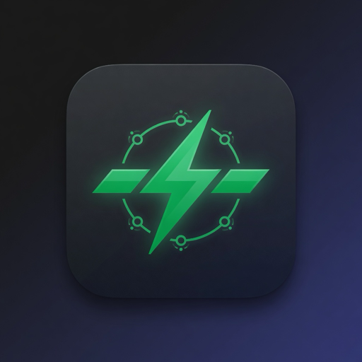
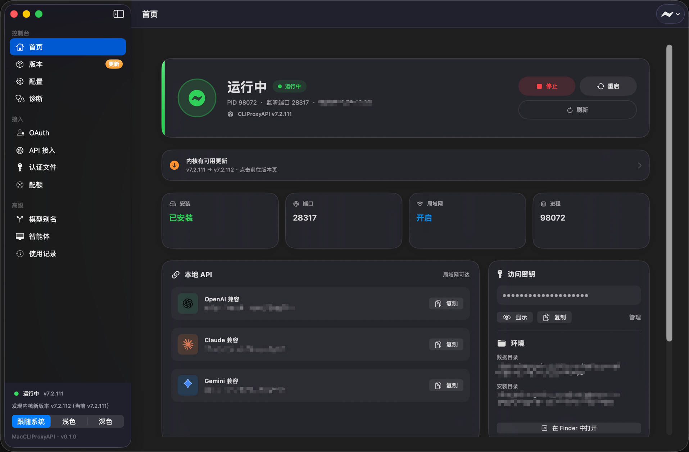
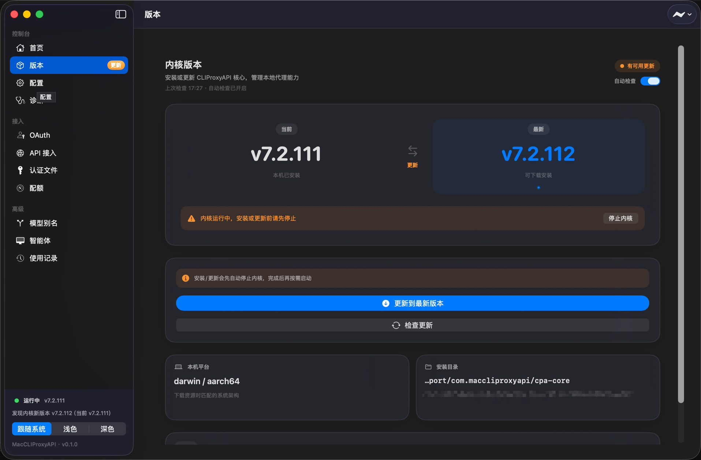
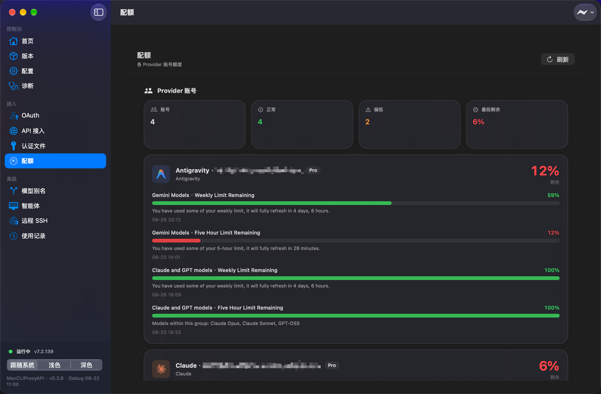
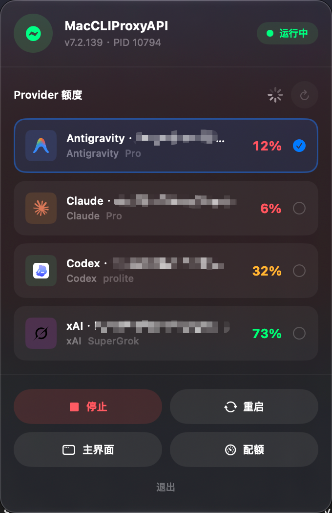
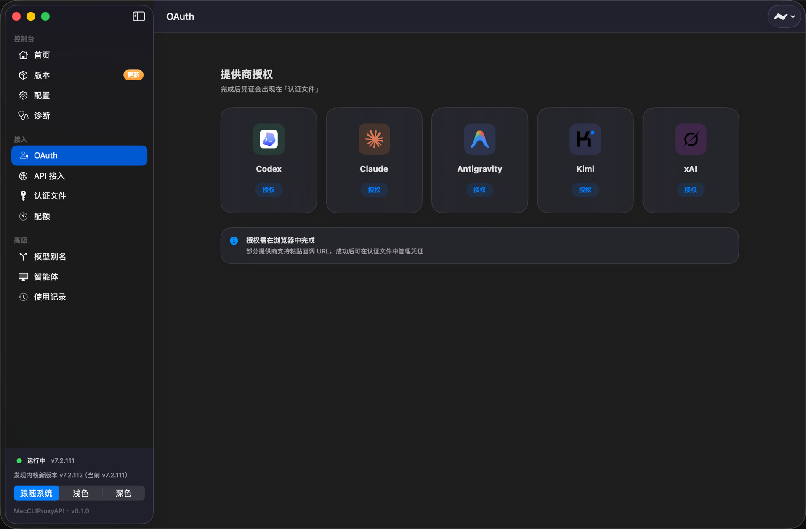
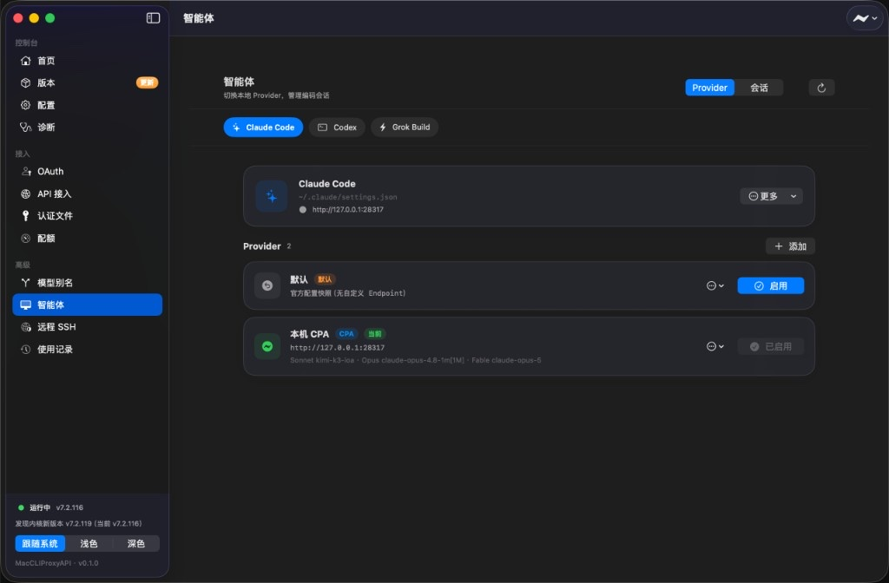
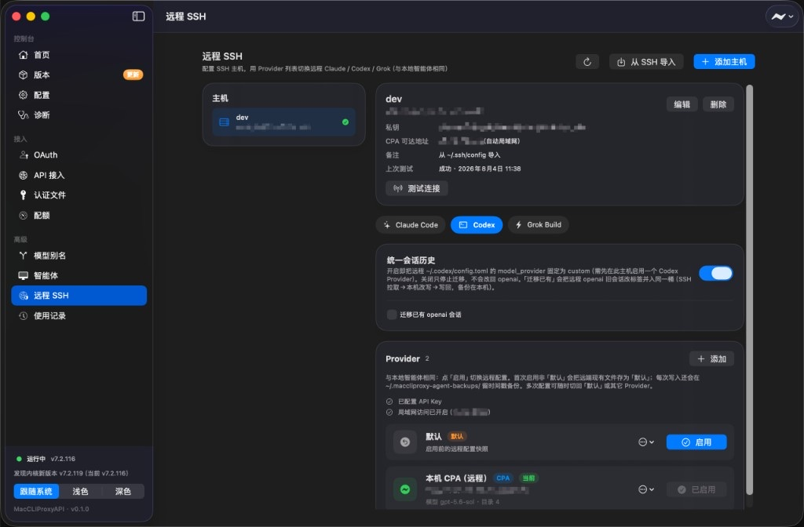
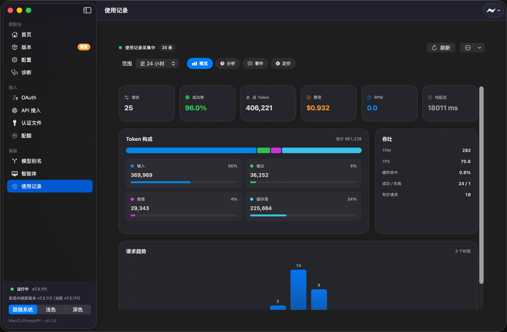

# MacCLIProxyAPI

<p align="center">
  
</p>

<p align="center">
  <strong>CLIProxyAPI 的 macOS 原生桌面控制台</strong><br/>
  安装与管理本地内核 · OAuth / Provider · 账号配额 · 使用记录 · 智能体一键配置
</p>

<p align="center">
  <a href="https://github.com/xiangsam/MacCLIProxyAPI/releases/latest"></a>
  
  
  <a href="LICENSE"></a>
</p>

---

## 目录

- [产品预览](#产品预览)
- [为什么做这个项目](#为什么做这个项目)
- [主要功能](#主要功能)
- [安装（预构建包 · 无需源码）](#安装预构建包--无需源码)
- [从源码构建](#从源码构建)
- [远程压缩与同名模型隔离](#远程压缩与同名模型隔离)
- [模型能力目录](#模型能力目录人和-harness-agent-共用)
- [安全与数据](#安全与数据)
- [项目结构](#项目结构)
- [使用边界](#使用边界)
- [致谢](#致谢)
- [上游与许可证](#上游与许可证)

---

## 产品预览

### 首页 · 内核状态与本地 API

一屏查看运行状态、局域网地址、OpenAI / Claude / Gemini 兼容端点与访问密钥。

<p align="center">
  
</p>

### 版本 · 内核安装与更新

在线安装最新内核、指定版本安装、本地包安装；内核运行时会提示先停止再安装。

<p align="center">
  
</p>

### 配额 · 订阅账号额度

展示各 OAuth 账号配额。

<p align="center">
  
</p>

### 菜单栏小窗 · 常驻状态与快捷操作

关闭主窗口后仍以菜单栏形态运行：内核启停、订阅账号额度一览，一键回到主界面。

<p align="center">
  
</p>

### 订阅授权 · 浏览器授权账号

Codex、Claude、Antigravity、Kimi、xAI 等授权流程图形化引导。

<p align="center">
  
</p>

### 客户端接入 · 本机 Claude Code / Codex 一键切换

统一管理 Claude Code、Codex 的客户端接入配置（`~/.claude/settings.json`、
`~/.codex/config.toml`）：支持官方直连、本机 CPA、自定义上游。点击「应用配置」写入文件，
「配置匹配」表示磁盘配置的地址、密钥与模型等关键字段匹配，不表示客户端进程已经重新加载。
首次应用会备份接管前配置；「接管前配置」用于还原快照，与「官方直连」含义不同。
编辑已应用的配置会立即更新本机文件，卡片支持重新应用。

Codex 的会话库策略只在下次应用配置时生效；当前配置改用共享库、迁移已有官方会话、撤销迁移
是独立操作。关闭策略不会隐式改写旧会话。Codex 本机 CPA 在缺少 `auth.json` 时写入占位，
切走时只删除应用创建的占位；模型列表缓存修复仍可从 CPA 卡片操作。
（Grok Build 客户端管理已移除；xAI / Grok 订阅仍可通过 OAuth 接入，经 Claude Code / Codex 使用。）

<p align="center">
  
</p>

### 远程 SSH · 从本地接入配置同步到远端

从 `~/.ssh/config` 导入主机，刷新列表会从本机客户端接入配置同步草稿。
CPA 地址转换为远端访问这台 Mac 的地址；第三方直连保留原 Endpoint/API Key。
接管前快照按主机独立保存，不从本地复制。旧版主机专属配置继续保留。

刷新列表不会写入远端，点击「应用到远程」才通过 SSH 写入并备份。
本地修改或会话库策略变化会显示「待同步」；「上次已写入」只表示成功写入记录，
不声称已经核验远端文件或进程状态。卡片始终允许重新应用，取消同步不会被显示为同步成功。

<p align="center">
  
</p>

### 使用记录 · 本地 SQLite 采集

从内核 usage 队列采集到本地数据库，支持概览、分析、事件与导出。用量按**凭据**归属，
同一个 API Provider 的多条路由（如聊天与原生 GPT）会合并计入同一个 Provider，而非计入 Codex 订阅。

<p align="center">
  
</p>

---

## 为什么做这个项目

[CLIProxyAPI](https://github.com/router-for-me/CLIProxyAPI) 提供统一的本地 AI API 代理能力，但日常还需要处理：

- 内核下载 / 升级 / 启停  
- 配置文件与 API Key  
- OAuth 凭证与配额  
- 客户端（Claude Code、Codex 等）接入  

MacCLIProxyAPI 把这些收敛到一个 **SwiftUI 原生应用** 中：

- 非 WebView、非跨平台套壳  
- 通过 Management API 管理运行时  
- 使用记录保存在本地 SQLite  
- 关闭主窗口后可继续以 **菜单栏** 形态运行  
- 不附带云端服务，数据默认只在本机  

---

## 主要功能

| 模块 | 功能 |
| --- | --- |
| 首页 | 内核状态、启停/重启；复制 OpenAI / Claude / Gemini 接入地址与 API Key |
| 版本 | 检查更新；在线安装最新版 / 指定版本 / 本地包安装；安装前二次确认与架构、归档校验 |
| 配置 | 端口、局域网、API Keys、路由、上游代理、Session Affinity；展示内核已加载插件 |
| 订阅授权 | Codex、Claude、Antigravity、Kimi、xAI 浏览器授权 |
| 上游 API | 管理 Codex / OpenAI 兼容 / Claude / Gemini；连接测试 |
| 认证文件 | 查看、搜索、启停、上传、删除 OAuth/认证 JSON |
| **配额** | **OAuth 订阅账号额度** |
| 模型能力 | models.dev 规范模型目录；思考等级、模态、上下文与接入方差异；本地 JSON 导出 |
| 模型别名 | Thinking / Reasoning 别名与 effort |
| 客户端接入 | Claude / Codex：多接入配置应用；会话浏览 / 恢复 / 删除；会话库策略与独立迁移操作 |
| **远程 SSH** | **从 `~/.ssh/config` 导入主机，从本地接入配置同步到远端；应用前快照、写入前备份** |
| 使用记录 | usage-queue → SQLite；概览 / 分析 / 事件 / 价格估算 / CSV 导出 |
| 诊断 | 内核、Management API、权限、弱密钥、Usage 库状态 |
| **菜单栏** | 内核快捷启停；所选账号剩余额度 |

---

## 安装（预构建包 · 无需源码）

从 [**Releases**](https://github.com/xiangsam/MacCLIProxyAPI/releases/latest) 下载其一：

```text
MacCLIProxyAPI-1.3-macos-universal.dmg      # 推荐：打开后拖进「应用程序」
MacCLIProxyAPI-1.3-macos-universal.zip      # 或者：解压后拖进「应用程序」
```

```bash
# 可选：校验（把文件名换成你下载的那个）
shasum -a 256 -c MacCLIProxyAPI-1.3-macos-universal.dmg.sha256

# 首次打开若提示无法验证开发者：
xattr -dr com.apple.quarantine /Applications/MacCLIProxyAPI.app
```

然后：

1. 打开应用 → **版本** → **更新到最新版本**（联网安装，也可指定版本或本地 `.tar.gz`）  
2. **首页** 启动内核  
3. **订阅授权 / 上游 API** 添加账号
4. 需要时在 **客户端接入** 为 Claude Code / Codex 等写入配置

应用本身**不含内核**：首次启动后从「版本」页联网安装，不需要本机装 Go 去编译。

### 自行打包发布

```bash
./scripts/release.sh          # 版本号取自 project.yml
./scripts/release.sh 0.2.1    # 仅覆盖产物文件名中的版本标注
```

输出在 `dist/`：

| 文件 | 说明 |
| --- | --- |
| `MacCLIProxyAPI-<version>-macos-<arch>.dmg` | 可分发应用（不含内核） |
| `MacCLIProxyAPI-<version>-macos-<arch>.zip` | 同上，zip 形式 |
| `*.sha256` | 对应产物的 SHA-256 |
| `RELEASE-NOTES-*.md` | 发布说明草稿 |

`dist/` 不入库：产物作为附件挂到远端 Release 页。

---

## 从源码构建

**要求：** macOS 14+ · Xcode 15+ · [XcodeGen](https://github.com/yonaskolb/XcodeGen)（改 `project.yml` 后需要）

```bash
brew install xcodegen
git clone https://github.com/xiangsam/MacCLIProxyAPI.git
cd MacCLIProxyAPI
xcodegen generate   # 修改 project.yml 后执行

xcodebuild \
  -project MacCLIProxyAPI.xcodeproj \
  -scheme MacCLIProxyAPI \
  -configuration Debug \
  -derivedDataPath build \
  -destination 'platform=macOS' \
  build

open build/Build/Products/Debug/MacCLIProxyAPI.app
```

### 测试

```bash
xcodebuild \
  -project MacCLIProxyAPI.xcodeproj \
  -scheme MacCLIProxyAPI \
  -configuration Debug \
  -derivedDataPath build \
  -destination 'platform=macOS' \
  test
```

---

## 远程压缩与同名模型隔离

这三个概念分别控制不同的事情：

| 设置 | 含义 | 作用范围 |
| --- | --- | --- |
| 同名 GPT 来源策略 | 正常路由 / 仅 Codex 订阅 / 仅上游 API，三选一 | CPA 内核，影响所有客户端 |
| 凭据优先级、调度算法与会话亲和 | 从允许参与的来源中选择凭据 | CPA 请求调度 |
| 服务端压缩 | 客户端是否配置使用 `/responses/compact` | 单个 Codex 接入配置 |

来源策略在「配置 → 同名模型」统一管理，保存时同时更新 OAuth 与 API 两侧的排除规则。
优先级不会覆盖来源排除；某一来源被完全排除后，也不会充当故障回退。
规则只覆盖应用维护的已知同名 GPT 模式，保留其他手工排除项。
新增上游或更新模型列表时同样应用该策略。切换本机或远程接入配置不会改变全局路由。
旧版全局“排除订阅”设置迁移为“仅上游 API”；旧版已写入 API 排除规则则迁移为“仅订阅”。
两者冲突时以原来的显式全局设置为准，不再保留双重排除状态。

Codex 自定义接入可配置服务端压缩（写入 `name = "OpenAI"`），但名称并不能证明服务端支持
压缩接口。界面区分“已配置”与“端点能力未验证”；官方配置的状态按实际配置读取。
CPA 的订阅路由策略与压缩设置需要分别选择，不能仅靠提高优先级保证压缩端点可用。

## 模型能力目录（人和 harness agent 共用）

「模型能力」页从 [models.dev 模型列表](https://models.dev/models/) 对应的
[公开 catalog JSON](https://models.dev/catalog.json?type=all) 同步资料。无需启动 CPA 内核。
支持名称/规范 ID 搜索、思考能力和图片输入筛选、接入方详情、复制单条 JSON、导出筛选结果。
首次使用点击「同步 models.dev」；此后可离线查看，刷新失败保留上次成功缓存和原更新时间。

**一个规范模型 ID 对应一条记录**，不按接入方重复列行：

- 模型字段：`id`、`name`、`lab`、`reasoning`、`inputModalities`、`outputModalities`、
  `contextWindow`、`maxInputTokens`、`maxOutputTokens`、`toolCall`、`structuredOutput`。
- `reasoningLevels` 是接入方明确列出的 effort 档位合集，`reasoningLevelsScope` 固定为
  `provider-dependent`，不能直接视为所有上游都支持。
- `providerVariants` 保存每个接入方的模型 ID、模态、长度限制及原始 `reasoningOptions`：
  effort、toggle、budget_tokens（上下限）；合法的 `null` 档位值也保留在原始选项中。
- 未提供的可选字段省略，不把未知当成“不支持”；只有来源明确为 false 才表示不支持。
  不根据模型名称猜测档位。没有 `canonical_model_id` 关联的接入记录不强行合并，
  数量保存在 `unmappedProviderModelCount`。
- 每个模型保留 `sourceURL`、`sourceUpdatedAt`；整个文件保留 `schemaVersion`、`source`、`fetchedAt`。
  模型资料与本机配置/别名、实际账号可用性是独立信息，不会自动覆盖客户端手工能力设置。

同步成功后，机器可读文件固定在：

```text
~/Library/Application Support/com.maccliproxyapi/model-capabilities.json
```

例如 harness agent 使用 `jq` 查询一个模型及各上游支持的思考参数：

```bash
jq '.models[] | select(.id == "openai/gpt-6.1-sol")' \
  "$HOME/Library/Application Support/com.maccliproxyapi/model-capabilities.json"
```

该文件只包含公开模型元数据，不包含账号或密钥；没有增加 HTTP 监听服务。

---

## 安全与数据

- 首次启动生成随机 API Key 与 Management Secret（非固定弱密钥）  
- 数据 / OAuth / usage 目录 `0700`；敏感配置文件 `0600`  
- 内核进程按 PID + 二进制路径 + 配置路径识别，避免误杀同名进程  
- 本地安装包校验：扩展名、路径穿越、二进制存在性、架构匹配  

数据目录：

```text
~/Library/Application Support/com.maccliproxyapi/
├── config.toml
├── api-keys.json
├── cpa-mac-process.json
├── oauth/
├── cpa-core/
├── model-capabilities.json # models.dev 模型能力目录
├── agents/                # 客户端接入配置与本机配置备份
├── remote-ssh/            # 远程主机与其默认配置快照
└── usage-records/usage.db
```

请勿在共享账号、不受信任设备或公网环境中使用敏感凭证。

---

## 项目结构

```text
App/           # SwiftUI 页面、菜单栏、AppState
Core/          # 模型、服务（内核 / OAuth / 配额 / Usage）
Tests/         # XCTest
docs/images/   # README 产品截图
scripts/       # release.sh · build-app.sh · add-source-file.py · sync-cc-switch-codex-catalog.sh
project.yml    # XcodeGen 工程定义
LICENSE        # MIT
```

---

## 使用边界

- 面向个人开发者与需要在本机管理 CLIProxyAPI 的用户  
- 当前以 Apple Silicon 与中文环境为主  
- 不承诺 App Store、公证或商业级支持  
- 不建议将服务直接暴露到公网；局域网模式仅在受信任网络启用  
- Provider / 配额接口可能随上游变化，请结合实际内核版本验证  

---

## 致谢

- [CLIProxyAPI](https://github.com/router-for-me/CLIProxyAPI) —— 本项目管理的内核本体，统一的本地 AI API 代理能力都由它提供，这个应用只是给它做了一层原生 macOS 控制台。
- [cc-switch](https://github.com/farion1231/cc-switch) —— Codex 模型 catalog 生成逻辑（`CodexModelCatalogWriter.swift` / `CodexModelCapabilities.swift`）参考并移植自该项目。
- [Yams](https://github.com/jpsim/Yams) —— YAML 解析。

---

## 上游与许可证

本项目自身代码以 [MIT License](LICENSE) 开源。应用是独立的 macOS GUI，**不包含** CLIProxyAPI 源码；内核及 Release 包遵循上游许可证。使用本仓库时请同时遵守 CLIProxyAPI、Yams、品牌图标及其他第三方资源的许可要求。
